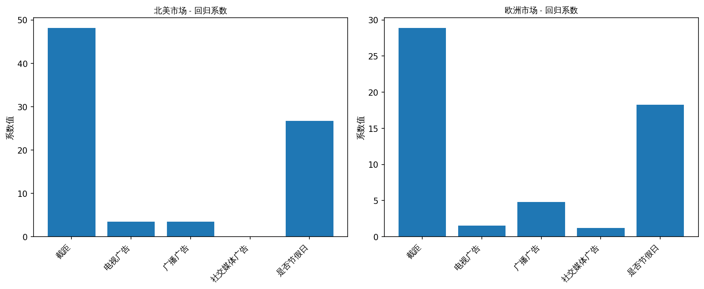

# 场景 B：真实世界数据分析报告

## 数据概览

- 北美市场样本量: 500
- 欧洲市场样本量: 500
- 特征: tv_budget, radio_budget, socialmedia_budget, is_holiday

## 模型拟合结果

### 北美市场 (CustomOLS)

| 特征 | 系数 |
|------|------|
| 截距 | 48.1036 |
| 电视广告 | 3.5075 |
| 广播广告 | 3.4977 |
| 社交媒体广告 | 0.0021 |
| 是否节假日 | 26.6990 |

### 欧洲市场 (CustomOLS)

| 特征 | 系数 |
|------|------|
| 截距 | 28.8605 |
| 电视广告 | 1.5102 |
| 广播广告 | 4.7987 |
| 社交媒体广告 | 1.2028 |
| 是否节假日 | 18.2465 |

## 联合显著性检验 (H₀: 所有广告投放系数 = 0)

### 北美市场

- F 统计量: 40840.7606
- p-value: 0.000000
- 约束个数: 4

### 欧洲市场

- F 统计量: 51595.1896
- p-value: 0.000000
- 约束个数: 4

## 业务解读

### 北美市场
✅ **广告投放策略有效**：在 5% 显著性水平下，广告投放对销售额有显著影响。

### 欧洲市场
✅ **广告投放策略有效**：在 5% 显著性水平下，广告投放对销售额有显著影响。

## 市场对比

### 结论

OOP 封装的优势：
1. 两个市场的数据完全隔离，互不干扰
2. 代码复用性高，只需实例化两个对象
3. 每个模型实例保存自己的参数和统计量
4. 易于扩展：增加第三个市场只需再加一个实例
